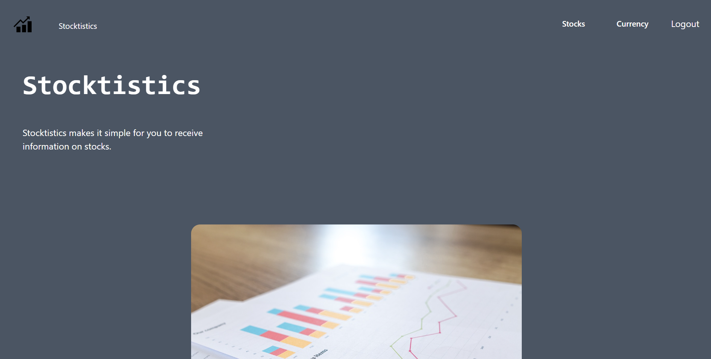
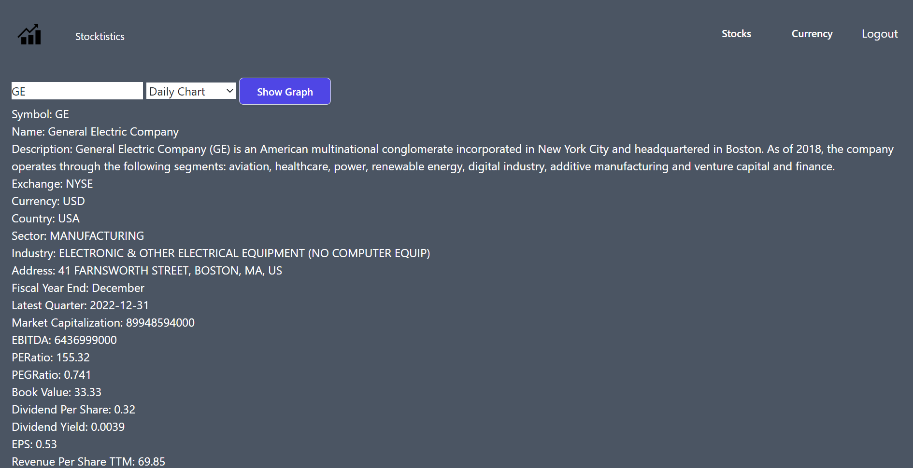
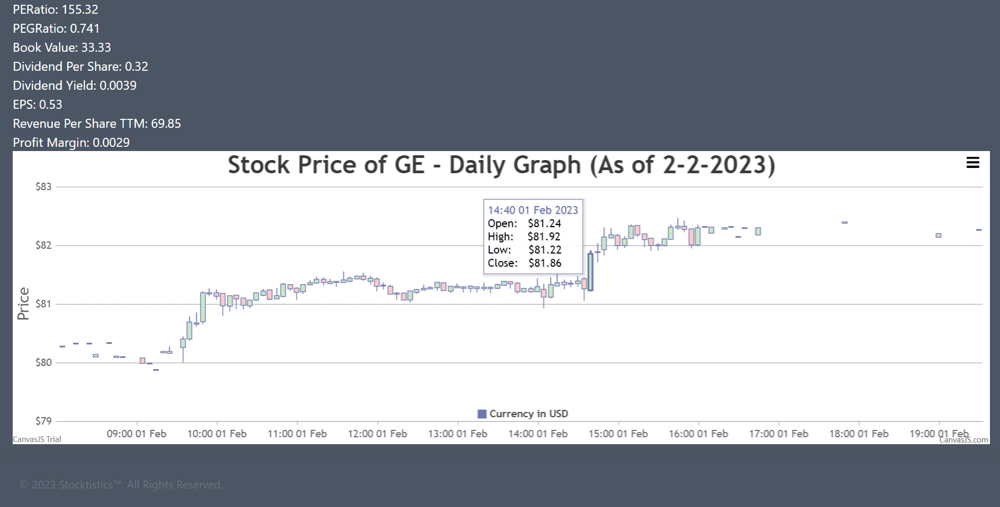
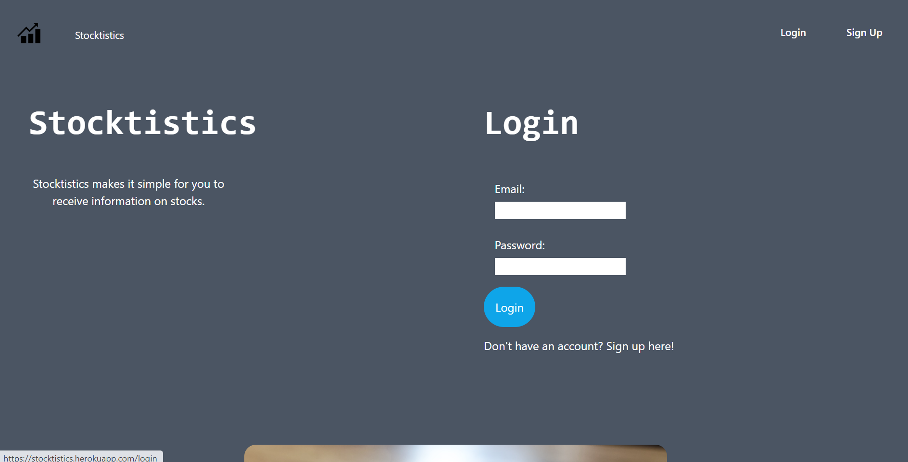
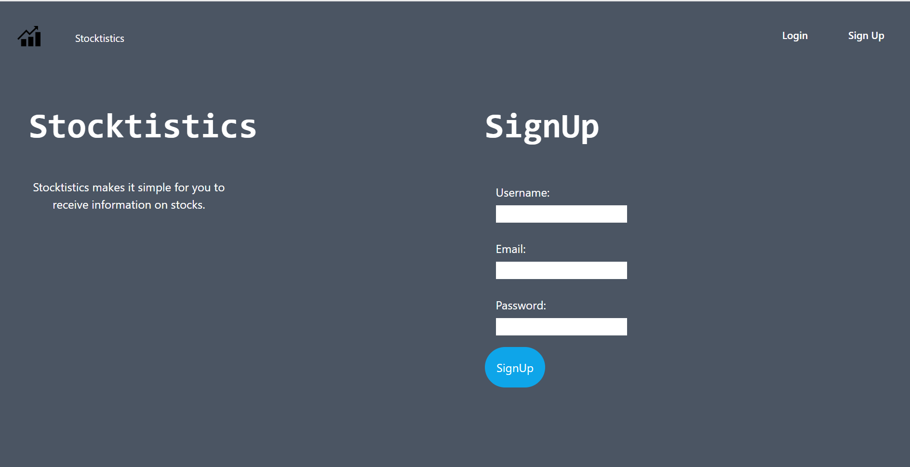

# Stocktistics

## Project Description
Our objective is to make it easier for people to receive stock information through our app. With our simplistic design and chart data you will be able to look up any stock you please with the stock symbol of your choosing. Other websites will make it difficult to follow the data unless you are familiar with stock information, our website allows for anyone to access basic stock information without being bombarded with complex stock data. Stocktistics lays out the information in a linear fashion so you are able to easily follow all the data presented.

## Usage
As a user,
I WANT to be able to search for stocks,
SO THAT I can get the trading values and receive chart data.

## Technologies Used
-Alpha Vantage API: Stock Data			

-CanvasJS: Graphs and Charts		

-TailWind CSS, Handlebars		

-Node JS, Express				

-MySQL				

-bcrypt

-Express

-Handlebars

## Installation
Please follow the instructions below to install the application.

git clone https://github.com/areyno20/stock-app

npm install

mysql - source db/schema.sql

npm run seed

npm start

## Live Website
Deployed page: https://stocktistics.herokuapp.com/

## Screenshots

